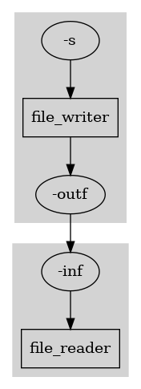

.. _implem:

Implementing DeBasher Programs
==============================

This section is devoted to explain the procedure of implementing new
DeBasher programs. There are four main aspects involved in this
procedure. First, creating and configuring a new module to store the
program and the different processes it executes. Second, implementing
the processes themselves that participate in the program. Third,
handling command-line and process options for the processes. And
finally, defining which processes will compose the program.

More specifically, the implementation of a DeBasher program can be
carried out in a process-wise manner. For each process, we will define a
set of Bash functions governing the process behavior and its
corresponding options. Option definition will implicitly define a
network connecting the inputs and outputs of the different processes.

The following sections explain how to implement a simple program with
two processes: ``file_writer`` and ``file_reader``. We will call this
process ``debasher_file_example``. The ``file_writer`` process takes a
string as input and writes it to a file. The ``file_reader`` process
takes this file and prints its content to the standard output.

The whole code will be added to a single module file called
``debasher_file_example.sh`` (the program name plus the ``.sh``
extension).

A process graph generated with ``debasher_exec`` using its
``--gen-proc-graph`` for the ``debasher_file_example.sh`` program would
look as follows:

The graph shows the two processes involved in the program (using
rectangles) as well as their input and output options (using ellipses)
and how such options are connected, implicitly defining the program
network.

Although it is not mandatory, it is recommended that the implementation
is made in the same order in which the sections appear.

Module Configuration
--------------------

TBD

Process Implementation
----------------------

TBD

Command-Line Option Explanation
-------------------------------

Once a particular process has been implemented, it is necessary to
ensure that it receives the information about the input and output
options it needs. Some of those options could be generated by other
processes, but others may need to be provided in the command-line.

In this section we explain how the command-line options are handled for
a DeBasher program. In particular, command-line options should be
provided when executing the program with ``debasher_exec``. If we
execute ``debasher_exec`` with the ``--show-cmdline-opts`` flag, a
description of the process options is displayed. This description is
collaboratively generated by the ``explain_cmdline_opts`` method
implemented for the different processes.

Below we show the result of executing ``debasher_exec`` with the
``--show-cmdline-opts`` flag for the ``debasher_file_example.sh``
module (only the part of the output related to the command-line options
is shown):

::

    # Command line options for the program...
    CATEGORY: GENERAL
    -s <string> String to be displayed [file_writer]

In this case, the program only defines one command-line option, ``-s``,
for the ``file_writer`` process. For this purpose, we define the
``explain_cmdline_opts`` method for the process, with the following
code:

.. code-block:: bash

    file_writer_explain_cmdline_opts()
    {
        # -s option
        local description="String to be displayed"
        explain_cmdline_opt "-s" "<string>" "$description"
    }

On the other hand, the ``file_reader`` process will not define any
command line option. In those cases, we can define the corresponding
``explain_cmdline_opts`` method for the process as follows:

.. code-block:: bash

    file_reader_explain_cmdline_opts()
    {
        :
    }

Option Definition/Generation
----------------------------

TBD

Program Definition
------------------

Once the processes involved in the ``debasher_file_example`` program
have been implemented, we can proceed with the definition of the program
itself.

Defining a program is extremely simple. For this purpose, we only need
to implement the ``program`` method for the ``debasher_file_example.sh``
module. This method will incorporate into the program the processes to
be executed. To add a process to a program we can use the
``add_debasher_process`` function:

.. code-block:: bash

    debasher_file_example_program()
    {
        add_debasher_process "file_writer" "cpus=1 mem=32 time=00:01:00"
        add_debasher_process "file_reader" "cpus=1 mem=32 time=00:01:00"
    }

When adding a process to a program, we can provide information about the
resources that the process requires. In the given example, both the
``file_writer`` and the ``file_reader`` processes will require 1 CPU,
32MBs of RAM a 1 minute for their execution.

Further Process, Program and Module Characterization
----------------------------------------------------

TBD

Examples
--------

.. toctree::

   fwriter_freader
